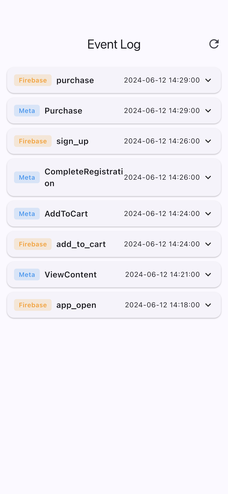
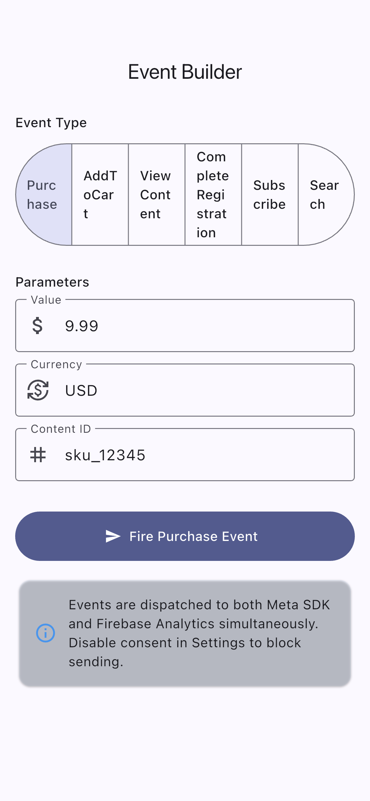
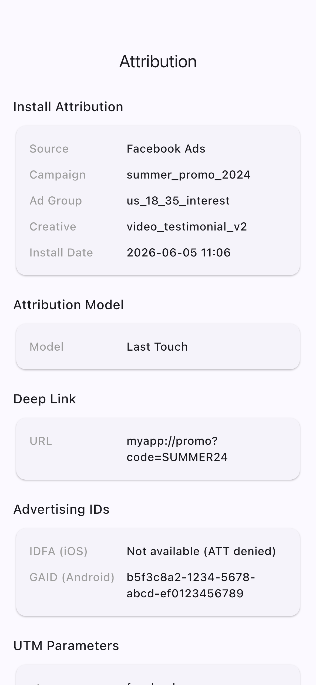
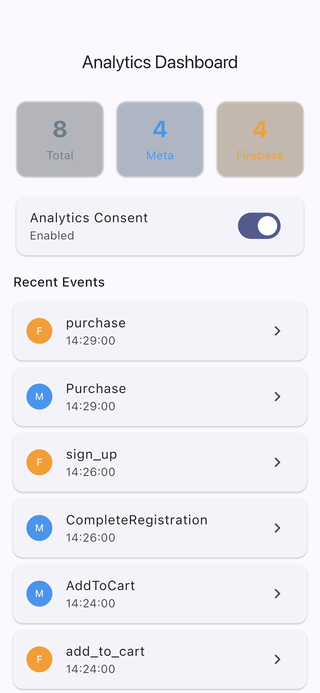

# flutter_analytics_sdk

A Flutter POC that wires up a unified mobile analytics layer: a single facade dispatches every event to both the Meta SDK (Facebook App Events) and Firebase Analytics in parallel, with consent gating, an offline event queue, conversion tracking, and install attribution. It is built with Riverpod for state management and Hive for the offline queue.

## Demo

These are real screenshots captured from the running app on the iOS Simulator (not mockups). See [FLOW.md](FLOW.md) for how they are generated.

| Dashboard | Event Log | Event Builder | Attribution |
| --- | --- | --- | --- |
|  |  |  |  |



## Features

- Dual dispatch: every event goes to Meta SDK and Firebase Analytics at the same time.
- Conversion tracking: Purchase, AddToCart, ViewContent, CompleteRegistration, Subscribe, Search with value, currency, and content parameters.
- Consent gating: GDPR / ATT-style toggles silently drop events when consent is revoked.
- Offline queue: events are persisted with Hive while offline and flushed automatically when connectivity returns.
- Live event log with per-source badges (Meta / Firebase) and expandable parameters.
- Install attribution: source, campaign, ad group, creative, deep link, UTM parameters, and IDFA / GAID status.

## Stack

- Flutter (Material 3)
- Riverpod (state management)
- Hive (offline event queue)
- firebase_analytics + firebase_core
- facebook_app_events (Meta SDK)
- connectivity_plus, intl

## Run

```bash
flutter pub get
flutter run
```

For screenshot regeneration, see [FLOW.md](FLOW.md).
